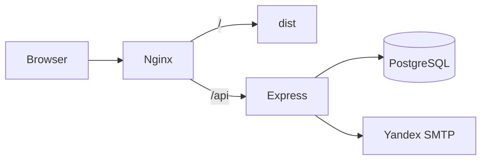

# Архитектура

## Обзор

Monorepo: React SPA + Node API + PostgreSQL, развёртываются через Docker Compose на VPS.



## Frontend (`src/`)

Feature-Sliced Design:

| Слой | Назначение |
|------|------------|
| `app/` | Роутер, Redux store, API-клиенты |
| `pages/` | AboutMe, Contact, PostsList, CodeExample |
| `widgets/` | AppHeader, фильтры, пагинация |
| `entities/` | Posts, Users, Comments |
| `shared/` | Константы, типы |

### Роутинг

`createBrowserRouter` — чистые URL (`/`, `/contact`, `/PostsList`, `/CodeExample/:id`).

nginx отдаёт `index.html` для неизвестных путей (SPA fallback).

### Posts demo

Демо-приложение на Redux + Saga, данные с JSONPlaceholder. Не связано с контактной формой.

## Backend (`server/`)

| Endpoint | Метод | Описание |
|----------|-------|----------|
| `/api/health` | GET | Healthcheck |
| `/api/contact` | POST | Приём заявки |

### Поток заявки

1. Форма на `/contact` → `POST /api/contact`
2. Валидация (zod)
3. INSERT в `contact_requests`
4. Email на `NOTIFY_EMAIL` через Яндекс SMTP
5. Ответ 201 клиенту (даже если email не ушёл — заявка в БД)

### Схема БД

```sql
contact_requests (id, name, contact, message, budget, status, created_at)
```

Миграции: `server/src/db/migrations/`.

## Docker Compose

**dev** (`docker-compose.yml`): postgres + api на localhost.

**prod** (`docker-compose.prod.yml`): postgres + api + nginx + certbot.

Конфиг nginx:
- `docker/nginx/conf.d/site.http.conf` — HTTP (старт)
- `docker/nginx/conf.d/site.ssl.conf.example` — шаблон HTTPS после certbot

## Переменные окружения

См. `.env.example`. Секреты только в `.env` на сервере, не в git.
